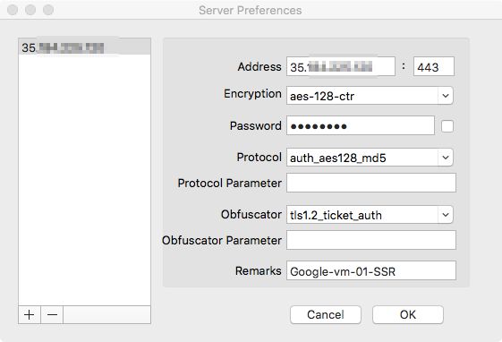

ShadowsocksR client with SSRoT for macOS
===========================
[](https://travis-ci.org/shadowsocks/shadowsocks-iOS)





macOS
-----
[](https://github.com/shadowsocks/shadowsocks-iOS/wiki/Shadowsocks-for-OSX-Help)  
[OSX Version](https://github.com/shadowsocks/shadowsocks-iOS/wiki/Shadowsocks-for-OSX-Help)


Build from source code
-----
**Dependencies**:
 * **Sodium** [Installation](https://download.libsodium.org/doc/installation/index.html)
 * **mbedTLS** [Installation](https://github.com/ARMmbed/mbedtls#cmake)
 * **libuv** [Installation](https://github.com/libuv/libuv#build-instructions)

Then pull **source code** and submodules
```bash
git clone https://github.com/ShadowsocksR-Live/ssrMac.git
cd ssrMac
git submodule update --init --recursive
git submodule foreach -q 'git checkout $(git config -f $toplevel/.gitmodules submodule.$name.branch || echo master)'
```


License
-------
The project is released under the terms of [GPLv3](https://raw.github.com/shadowsocks/shadowsocks-iOS/master/LICENSE).

Bugs and Issues
----------------

Please visit [issue tracker](https://github.com/ShadowsocksR-Live/ssrMac/issues?state=open)

Also see [troubleshooting](https://github.com/clowwindy/shadowsocks/wiki/Troubleshooting)
